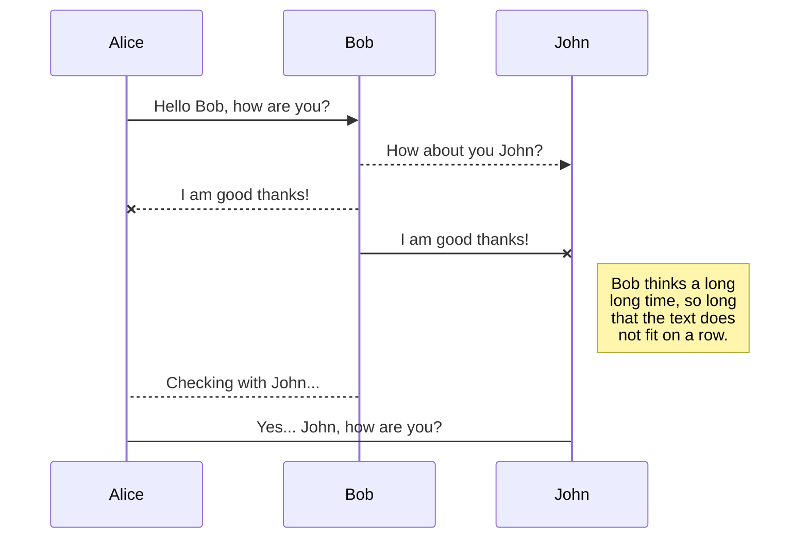
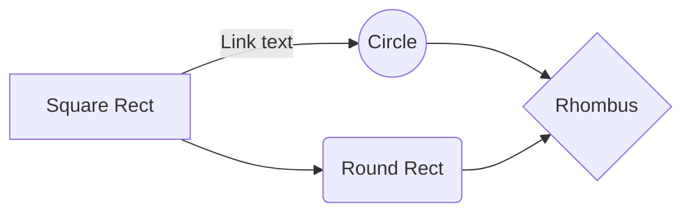

# iM Markdown에 오신 것을 환영합니다!

안녕하세요! **iM Markdown**의 첫 번째 마크다운 문서입니다. 마크다운을 직접 사용해보고 싶다면 이 내용을 자유롭게 수정하셔도 됩니다. 준비가 끝나면 왼쪽 상단의 **파일 탐색기**를 열어 새 문서를 생성할 수 있습니다.


# 파일 관리 (Files)

iM Markdown은 모든 문서를 사용자의 웹 브라우저 내부에 안전하게 저장합니다. 외부 서버 전송 없이 로컬에 자동 저장되며 **오프라인 및 사내/폐쇄망 환경**에서도 자유롭게 사용할 수 있습니다.

## 파일 및 폴더 생성

내비게이션 바의 왼쪽 상단 버튼을 클릭하여 파일 탐색기에 접근할 수 있습니다. 파일 탐색기에서 **새 파일 (New file)** 버튼을 클릭하여 새 문서를 생성할 수 있습니다. 또한 **새 폴더 (New folder)** 버튼을 클릭하여 폴더 구조를 만들 수 있습니다.

## 다른 파일로 전환

모든 파일과 폴더는 파일 탐색기에 트리 구조로 표시됩니다. 원하는 파일을 클릭하여 빠르게 전환할 수 있습니다.

## 파일 이름 변경

내비게이션 바의 파일 이름을 클릭하거나 파일 탐색기의 **이름 변경 (Rename)** 옵션을 클릭하여 문서 제목을 변경할 수 있습니다.

## 파일 삭제

파일 탐색기의 **삭제 (Remove)** 옵션을 클릭하여 현재 파일을 삭제할 수 있습니다. 삭제된 파일은 **휴지통 (Trash)** 폴더로 이동되며, 일정 기간 동안 보관된 후 관리됩니다.

## 파일 내보내기

메뉴에서 **가져오기/내보내기**를 클릭하여 작성한 문서를 내보낼 수 있습니다. 일반 Markdown 파일, HTML, 또는 PDF 등 필요한 형식으로 선택하여 저장할 수 있습니다.


# 코드 작성 예시 (Code Examples)

iM Markdown은 다양한 프로그래밍 언어 및 마크다운 구문에 대한 하이라이팅을 지원합니다.

```typescript
// TypeScript 예제
interface User {
  id: number;
  name: string;
}

const currentUser: User = {
  id: 1,
  name: "iM Markdown",
};
console.log(`Hello, ${currentUser.name}!`);
```

```java
// Java 예제
public class Main {
    public static void main(String[] args) {
        System.out.println("Hello, iM Markdown!");
    }
}
```

```html
<!-- HTML 예제 -->
<div class="welcome-container">
  <h1>iM Markdown</h1>
  <p>안전한 로컬 마크다운 에디터</p>
</div>
```

```css
/* CSS 예제 */
.welcome-container {
  display: flex;
  flex-direction: column;
  padding: 16px;
  background-color: #f5f5f5;
}
```


# Markdown 확장 기능 (Markdown Extensions)

iM Markdown은 표준 마크다운 구문 외에도 다양한 풍부한 **Markdown 확장 기능**을 제공합니다.

> **팁:** **파일 속성 (File properties)** 대화상자에서 언제든지 **Markdown 확장 기능**을 켜거나 끌 수 있습니다.


## SmartyPants

SmartyPants는 ASCII 문장 부호를 보기 좋은 타이포그래피 문장 부호로 자동 변환합니다. 예시:

|                |ASCII                          |HTML                         |
|----------------|-------------------------------|-----------------------------|
|Single backticks|`'Isn't this fun?'`            |'Isn't this fun?'            |
|Quotes          |`"Isn't this fun?"`            |"Isn't this fun?"            |
|Dashes          |`-- is en-dash, --- is em-dash`|-- is en-dash, --- is em-dash|


## KaTeX 수식

KaTeX를 사용하여 고품질 LaTeX 수식을 빠르게 렌더링할 수 있습니다:

$\Gamma(n) = (n-1)!\quad\forall n\in\mathbb N$을 만족하는 *Gamma 오일러 적분 함수*:

$$
\Gamma(z) = \int_0^\infty t^{z-1}e^{-t}dt\,.
$$


## UML 다이어그램 (Mermaid)

Mermaid를 사용하여 UML 다이어그램 및 플로우차트를 손쉽게 작성할 수 있습니다.

**시퀀스 다이어그램 예시:**



**플로우차트 예시:**


