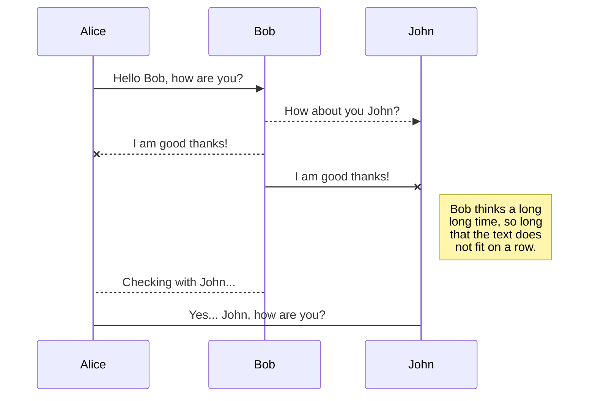
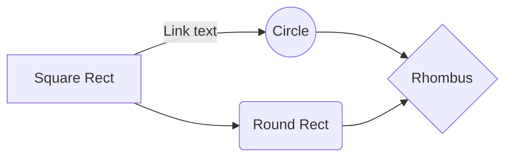

# StackEdit에 오신 것을 환영합니다!

안녕하세요! **StackEdit**의 첫 번째 Markdown 파일입니다. StackEdit에 대해 알아보고 싶다면 이 글을 읽어보세요. Markdown을 직접 사용해보고 싶다면 이 내용을 자유롭게 수정하셔도 됩니다. 준비가 끝나면 내비게이션 바의 왼쪽 모서리에 있는 **파일 탐색기**를 열어 새 파일을 생성할 수 있습니다.

# 파일 (Files)

StackEdit은 파일들을 브라우저 내부에 저장합니다. 이는 모든 파일이 로컬에 자동으로 저장되며 **오프라인**에서도 접근 가능함을 의미합니다!

## 파일 및 폴더 생성

내비게이션 바의 왼쪽 모서리에 있는 버튼을 사용하여 파일 탐색기에 접근할 수 있습니다. 파일 탐색기에서 **새 파일 (New file)** 버튼을 클릭하여 새 파일을 만들 수 있습니다. 또한 **새 폴더 (New folder)** 버튼을 클릭하여 폴더를 생성할 수 있습니다.

## 다른 파일로 전환

모든 파일과 폴더는 파일 탐색기에 트리 구조로 표시됩니다. 트리에서 파일을 클릭하여 원하는 파일로 전환할 수 있습니다.

## 파일 이름 변경

내비게이션 바의 파일 이름을 클릭하거나 파일 탐색기의 **이름 변경 (Rename)** 버튼을 클릭하여 현재 파일의 이름을 변경할 수 있습니다.

## 파일 삭제

파일 탐색기의 **삭제 (Remove)** 버튼을 클릭하여 현재 파일을 삭제할 수 있습니다. 삭제된 파일은 **휴지통 (Trash)** 폴더로 이동되며 7일간 활동이 없으면 자동으로 영구 삭제됩니다.

## 파일 내보내기

메뉴에서 **디스크로 내보내기 (Export to disk)**를 클릭하여 현재 파일을 내보낼 수 있습니다. 일반 Markdown 파일, Handlebars 템플릿을 사용한 HTML, 또는 PDF 형식으로 내보내도록 선택할 수 있습니다.

# 동기화 (Synchronization)

동기화는 StackEdit의 가장 강력한 기능 중 하나입니다. 워크스페이스의 모든 파일을 **Google Drive**, **Dropbox**, **GitHub** 계정에 저장된 다른 파일들과 동기화할 수 있습니다. 이를 통해 다른 기기에서도 계속 작성하고, 공유받은 사람들과 협업하며, 개발 워크플로우에 쉽게 통합할 수 있습니다. 동기화 메커니즘은 백그라운드에서 매 분마다 실행되어 파일 변경 사항을 다운로드, 병합(Merge) 및 업로드합니다.

두 가지 유형의 동기화 방식이 존재하며 서로 보완적으로 작동할 수 있습니다:

- 워크스페이스 동기화: 모든 파일, 폴더 및 설정을 자동으로 동기화합니다. 이를 통해 다른 기기에서도 동일한 워크스페이스를 불러올 수 있습니다.
	> 워크스페이스 동기화를 시작하려면 메뉴에서 Google 계정으로 로그인하면 됩니다.

- 파일 동기화: 워크스페이스의 특정 단일 파일을 **Google Drive**, **Dropbox**, 또는 **GitHub**의 하나 이상의 파일과 동기화 상태로 유지합니다.
	> 파일 동기화를 시작하기 전에 **동기화 (Synchronize)** 서브 메뉴에서 계정을 연결해야 합니다.

## 파일 열기

**동기화 (Synchronize)** 서브 메뉴를 열고 **다음에서 열기 (Open from)**를 클릭하여 **Google Drive**, **Dropbox**, 또는 **GitHub**에서 파일을 열 수 있습니다. 워크스페이스에서 열린 후 파일의 수정 사항은 자동으로 동기화됩니다.

## 파일 저장

**동기화 (Synchronize)** 서브 메뉴를 열고 **다음에 저장 (Save on)**을 클릭하여 워크스페이스의 모든 파일을 **Google Drive**, **Dropbox**, 또는 **GitHub**에 저장할 수 있습니다. 이미 동기화된 파일이더라도 다른 위치에 추가로 저장할 수 있습니다. StackEdit은 하나의 파일을 여러 위치 및 계정과 동기화할 수 있습니다.

## 파일 동기화 실행

파일이 동기화 위치에 연결되면 StackEdit은 주기적으로 변경 사항을 다운로드/업로드하여 동기화합니다. 필요한 경우 병합(Merge)이 수행되며 충돌(Conflict)이 해결됩니다.

파일을 방금 수정했고 즉시 동기화하고 싶다면 내비게이션 바의 **지금 동기화 (Synchronize now)** 버튼을 클릭하세요.

> **참고:** 동기화할 파일이 없는 경우 **지금 동기화** 버튼이 비활성화됩니다.

## 파일 동기화 관리

하나의 파일이 여러 위치와 동기화될 수 있으므로 **동기화 (Synchronize)** 서브 메뉴에서 **파일 동기화 (File synchronization)**를 클릭하여 동기화된 위치 목록을 확인하고 관리할 수 있습니다. 이를 통해 파일에 연결된 동기화 위치 목록을 조회하고 제거할 수 있습니다.

# 게시 (Publication)

StackEdit의 게시 기능을 사용하면 파일을 온라인에 쉽게 게시할 수 있습니다. 파일 작성이 완료되면 **Blogger**, **Dropbox**, **Gist**, **GitHub**, **Google Drive**, **WordPress**, **Zendesk** 등 다양한 호스팅 플랫폼에 게시할 수 있습니다. [Handlebars 템플릿](http://handlebarsjs.com/)을 활용하여 내보내는 형식을 완벽하게 제어할 수 있습니다.

> 게시를 시작하기 전에 **게시 (Publish)** 서브 메뉴에서 계정을 연결해야 합니다.

## 파일 게시

**게시 (Publish)** 서브 메뉴를 열고 **다음에 게시 (Publish to)**를 클릭하여 파일을 게시할 수 있습니다. 일부 플랫폼의 경우 다음 형식 중 선택할 수 있습니다:

- Markdown: 텍스트 해석이 가능한 웹사이트(**GitHub** 등)에 Markdown 원문으로 게시,
- HTML: Handlebars 템플릿을 거쳐 HTML로 변환된 파일 게시(예: 블로그 게시물).

## 게시물 업데이트

게시 후 StackEdit은 파일을 해당 게시물과 연결된 상태로 유지하므로 쉽게 재게시할 수 있습니다. 파일을 수정한 후 게시물을 업데이트하려면 내비게이션 바의 **지금 게시 (Publish now)** 버튼을 클릭하세요.

> **참고:** 파일이 아직 게시되지 않은 경우 **지금 게시** 버튼이 비활성화됩니다.

## 파일 게시 관리

하나의 파일이 여러 위치에 게시될 수 있으므로 **게시 (Publish)** 서브 메뉴에서 **파일 게시 (File publication)**를 클릭하여 게시 위치 목록을 확인하고 관리할 수 있습니다. 이를 통해 파일에 연결된 게시 위치 목록을 조회하고 제거할 수 있습니다.

# Markdown 확장 (Markdown extensions)

StackEdit은 표준 Markdown 구문을 확장하는 추가 **Markdown 확장기능**을 제공하여 유용한 기능을 추가로 지원합니다.

> **팁:** **파일 속성 (File properties)** 대화상자에서 언제든지 **Markdown 확장기능**을 비활성화할 수 있습니다.

## SmartyPants

SmartyPants는 ASCII 문장 부호를 "스마트한" 타이포그래피 문장 부호 HTML 엔티티로 변환합니다. 예시:

|                |ASCII                          |HTML                         |
|----------------|-------------------------------|-----------------------------|
|Single backticks|`'Isn't this fun?'`            |'Isn't this fun?'            |
|Quotes          |`"Isn't this fun?"`            |"Isn't this fun?"            |
|Dashes          |`-- is en-dash, --- is em-dash`|-- is en-dash, --- is em-dash|

## KaTeX

[KaTeX](https://khan.github.io/KaTeX/)를 사용하여 LaTeX 수식을 렌더링할 수 있습니다:

$\Gamma(n) = (n-1)!\quad\forall n\in\mathbb N$을 만족하는 *Gamma 오일러 적분 함수*:

$$
\Gamma(z) = \int_0^\infty t^{z-1}e^{-t}dt\,.
$$

> **LaTeX** 수식 표현에 대한 자세한 정보는 [여기](http://meta.math.stackexchange.com/questions/5020/mathjax-basic-tutorial-and-quick-reference)에서 확인할 수 있습니다.

## UML 다이어그램

[Mermaid](https://mermaidjs.github.io/)를 사용하여 UML 다이어그램을 렌더링할 수 있습니다. 예를 들어, 아래 코드는 시퀀스 다이어그램을 생성합니다:

그리고 아래 코드는 플로우차트를 생성합니다:

