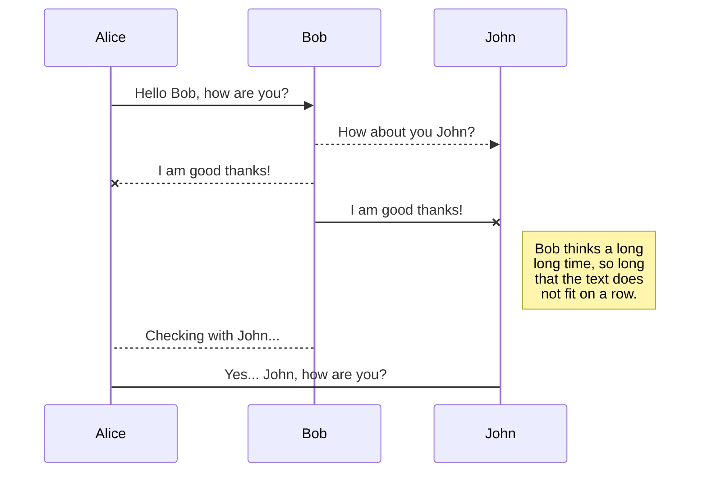
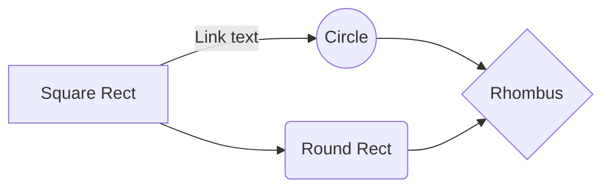

# iM뱅크MD에 오신 것을 환영합니다!

안녕하세요! **iM뱅크MD**의 첫 번째 Markdown 파일입니다. Markdown을 직접 사용해보고 싶다면 이 내용을 자유롭게 수정하셔도 됩니다. 준비가 끝나면 내비게이션 바의 왼쪽 모서리에 있는 **파일 탐색기**를 열어 새 파일을 생성할 수 있습니다.

# 파일 (Files)

iM뱅크MD는 파일들을 브라우저 내부에 저장합니다. 이는 모든 파일이 로컬에 자동으로 저장되며 **오프라인**에서도 접근 가능함을 의미합니다!

## 파일 및 폴더 생성

내비게이션 바의 왼쪽 모서리에 있는 버튼을 사용하여 파일 탐색기에 접근할 수 있습니다. 파일 탐색기에서 **새 파일 (New file)** 버튼을 클릭하여 새 파일을 만들 수 있습니다. 또한 **새 폴더 (New folder)** 버튼을 클릭하여 폴더를 생성할 수 있습니다.

## 다른 파일로 전환

모든 파일과 폴더는 파일 탐색기에 트리 구조로 표시됩니다. 트리에서 파일을 클릭하여 원하는 파일로 전환할 수 있습니다.

## 파일 이름 변경

내비게이션 바의 파일 이름을 클릭하거나 파일 탐색기의 **이름 변경 (Rename)** 버튼을 클릭하여 현재 파일의 이름을 변경할 수 있습니다.

## 파일 삭제

파일 탐색기의 **삭제 (Remove)** 버튼을 클릭하여 현재 파일을 삭제할 수 있습니다. 삭제된 파일은 **휴지통 (Trash)** 폴더로 이동되며 7일간 활동이 없으면 자동으로 영구 삭제됩니다.

## 파일 내보내기

메뉴에서 **가져오기/내보내기**를 클릭하여 현재 파일을 내보낼 수 있습니다. 일반 Markdown 파일, Handlebars 템플릿을 사용한 HTML, 또는 PDF 형식으로 내보내도록 선택할 수 있습니다.

# Markdown 확장 (Markdown extensions)

iM뱅크MD는 표준 Markdown 구문을 확장하는 추가 **Markdown 확장기능**을 제공하여 유용한 기능을 추가로 지원합니다.

> **팁:** **파일 속성 (File properties)** 대화상자에서 언제든지 **Markdown 확장기능**을 비활성화할 수 있습니다.

## SmartyPants

SmartyPants는 ASCII 문장 부호를 "스마트한" 타이포그래피 문장 부호 HTML 엔티티로 변환합니다. 예시:

|                |ASCII                          |HTML                         |
|----------------|-------------------------------|-----------------------------|
|Single backticks|`'Isn't this fun?'`            |'Isn't this fun?'            |
|Quotes          |`"Isn't this fun?"`            |"Isn't this fun?"            |
|Dashes          |`-- is en-dash, --- is em-dash`|-- is en-dash, --- is em-dash|

## KaTeX

KaTeX를 사용하여 LaTeX 수식을 렌더링할 수 있습니다:

$\Gamma(n) = (n-1)!\quad\forall n\in\mathbb N$을 만족하는 *Gamma 오일러 적분 함수*:

$$
\Gamma(z) = \int_0^\infty t^{z-1}e^{-t}dt\,.
$$

## UML 다이어그램

Mermaid를 사용하여 UML 다이어그램을 렌더링할 수 있습니다. 예를 들어, 아래 코드는 시퀀스 다이어그램을 생성합니다:

그리고 아래 코드는 플로우차트를 생성합니다:

